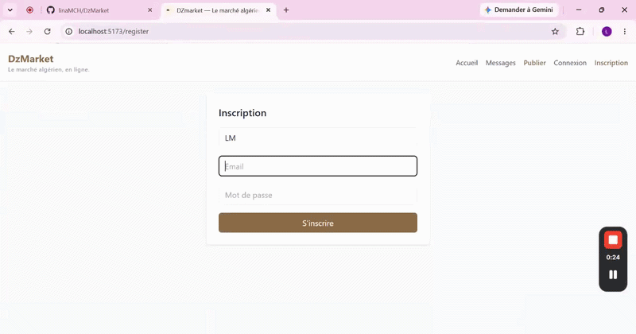
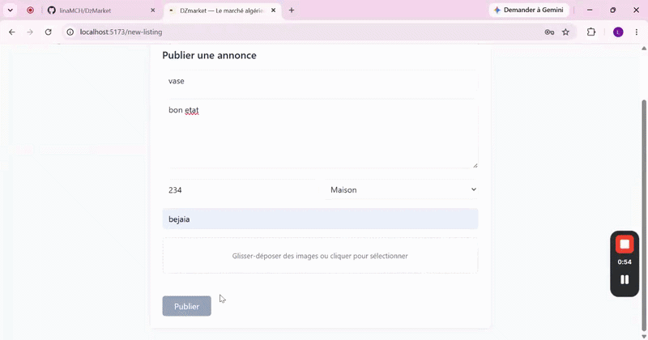
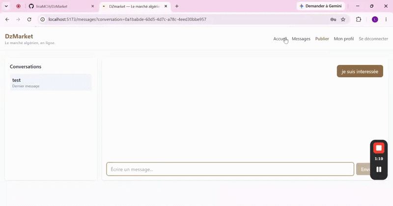
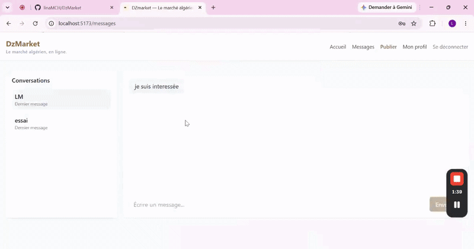

# DZmarket


> **Live demo:** _coming soon 

---

## Overview

**DZmarket** is a full-stack classifieds marketplace built for the Algerian market — think Leboncoin, but faster, cleaner, and open-source.

It covers the full product loop: post an ad, upload photos, search by category and city, and chat directly with sellers — all in one modern React app backed by Supabase. Built as a portfolio project, it demonstrates real-world patterns: protected routing, file storage, async data fetching with React Query, and one-command Vercel deployment.

> If you've ever wondered what a production-grade marketplace looks like under the hood — this is it.

---

## 🎬 Démonstration

### 🔎 Browse by category
Quickly filter listings and discover products that match your interests.



### 📝 Create a new listing
Publish a product with photos, price, and location in a few simple steps.



### 💬 Start a conversation
Chat directly with sellers from the product detail page.



### 👤 Manage your profile
Update your avatar and keep your account information up to date.



---

## Features

### Authentication
- Sign up, sign in, sign out via Supabase Auth
- Protected routes — unauthenticated users are redirected automatically
- User profile with editable avatar stored in Supabase Storage

### Listings
- Create, edit, and delete ads with full form validation
- Multi-image upload to Supabase Storage (`product-images` bucket)
- Category and city fields for structured discovery
- Owner-only controls on product detail pages

### Search & Discovery
- Accent-insensitive search across listing titles
- Filter by category and city
- Real-time local filtering without extra API calls

### Messaging
- Buyer ↔ seller conversations scoped to a product
- Message thread view per conversation

### UX
- Toast notification system for all user actions
- Responsive layout with Tailwind CSS
- Clean multi-page navigation: Home · Post · Detail · Messages · Profile

---

## Tech Stack

| Technology | Role | Version |
|---|---|---|
| React | Frontend UI library | 18.2.0 |
| React Router DOM | Client-side routing | 6.14.1 |
| Supabase JS | Auth · Database · Storage | 2.108.2 |
| TanStack React Query | Data fetching and caching | 5.2.0 |
| Vite | Build tool and dev server | 5.2.0 |
| Tailwind CSS | Utility-first styling | 3.4.8 |
| Vercel | Deployment platform | — |

---

## Architecture

```text
src/
├── components/     # Reusable UI: Navbar, ProductCard, ImageUploader, Toast…
├── context/        # AuthContext, ToastContext
├── hooks/          # Custom React hooks
├── pages/          # Route-level views: Home, Login, Register,
│                   # NewListing, ProductDetail, Messages, Profile
├── services/       # Supabase integration layer
│   ├── supabaseClient.js
│   ├── authService.js
│   ├── productService.js
│   ├── messageService.js
│   └── storageService.js
├── utils/          # Helpers and constants
├── App.jsx         # Routes, providers, auth guard
└── main.jsx        # Entry point
```

All Supabase interactions are centralized in `src/services/` — the UI never calls Supabase directly.

---

## Getting Started

### Prerequisites

- Node.js 18+
- npm or pnpm
- A [Supabase](https://supabase.com) project

### Clone & install

```bash
git clone https://github.com/linaMCH/dzmarket.git
cd dzmarket
npm install
```

### Environment variables

Create a `.env` file at the project root:

```env
VITE_SUPABASE_URL=your_supabase_project_url
VITE_SUPABASE_ANON_KEY=your_supabase_anon_key
```

### Run locally

```bash
npm run dev
# → http://localhost:5173
```

---

## Supabase Configuration

### Tables

```sql
-- profiles
id         uuid references auth.users primary key
name       text
city       text
avatar_url text

-- products
id          uuid default gen_random_uuid() primary key
title       text
description text
price       numeric
category    text
city        text
images      text[]
seller_id   uuid references profiles(id)
is_active   boolean default true
created_at  timestamptz default now()

-- conversations
id          uuid default gen_random_uuid() primary key
buyer_id    uuid references profiles(id)
seller_id   uuid references profiles(id)
product_id  uuid references products(id)
created_at  timestamptz default now()

-- messages
id              uuid default gen_random_uuid() primary key
conversation_id uuid references conversations(id)
sender_id       uuid references profiles(id)
text            text
created_at      timestamptz default now()
```

### Storage buckets

| Bucket | Usage |
|---|---|
| `product-images` | Listing photos |
| `avatars` | Profile pictures |

Enable RLS on both buckets and configure policies to allow authenticated users to upload to their own folder.

---

## Deployment on Vercel

1. Push the project to GitHub
2. Import the repository in [Vercel](https://vercel.com)
3. Add environment variables in **Project Settings → Environment Variables**:
   - `VITE_SUPABASE_URL`
   - `VITE_SUPABASE_ANON_KEY`
4. Deploy — Vercel auto-detects Vite, no extra config needed
5. Verify Supabase Storage CORS settings allow your Vercel domain

---

## Roadmap

- [ ] Real-time messaging with Supabase Realtime
- [ ] Favorites and saved searches
- [ ] Advanced filters (price range, date, condition)
- [ ] Listing moderation and report system
- [ ] Secure payment integration for featured listings

---

## Author

Built by **Maouche Lina** — software engineering student at the University of Béjaïa, Algeria, specializing in full-stack development.

[](https://github.com/linaMCH)
[](https://linkedin.com/in/lina-maouche-774510334/)

Open to freelance opportunities and junior full-stack roles — feel free to reach out.

---

## License

This project is licensed under the [MIT License](./LICENSE).
